# BKEDU Project HCMUT-18

## About the project

Application to support online teaching and learning for students and teachers.

## System requirements

Android: Android 4.0+ (best with 8.1+)

## Some Screenshots

  

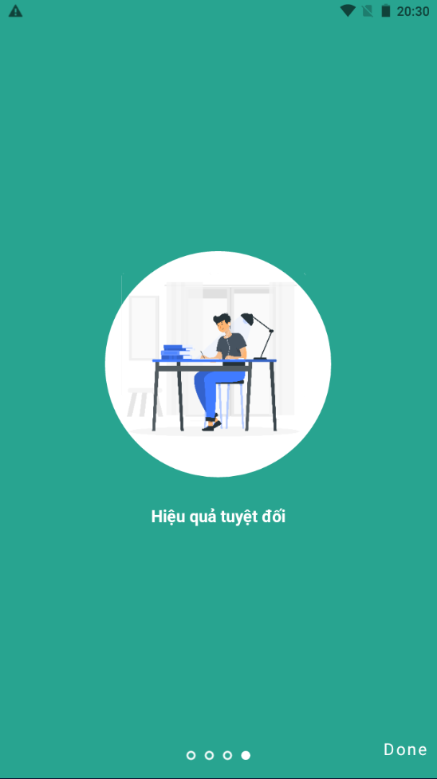

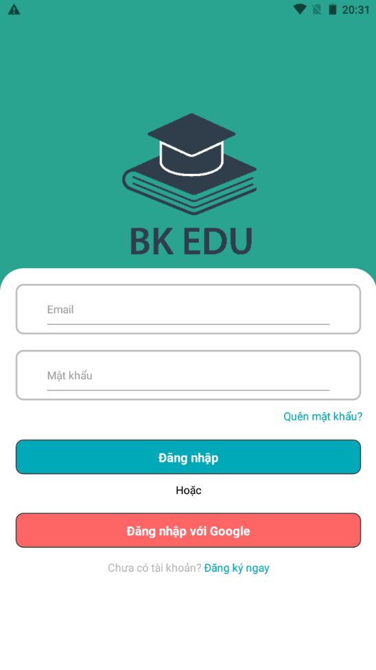

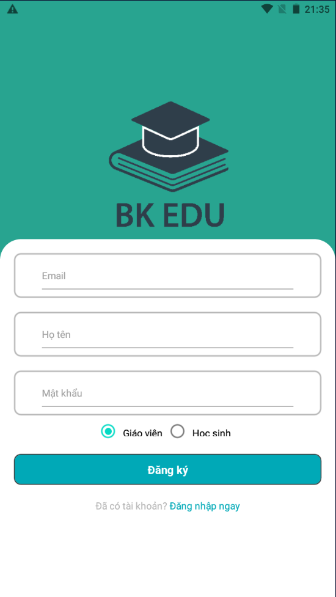

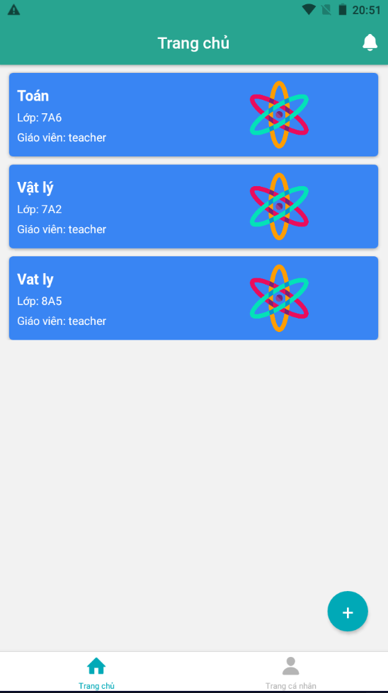

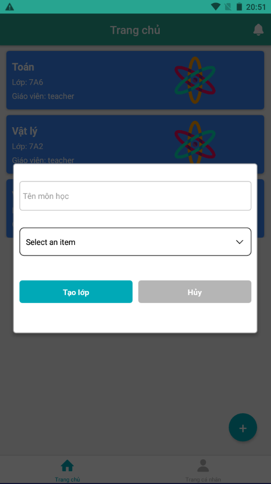

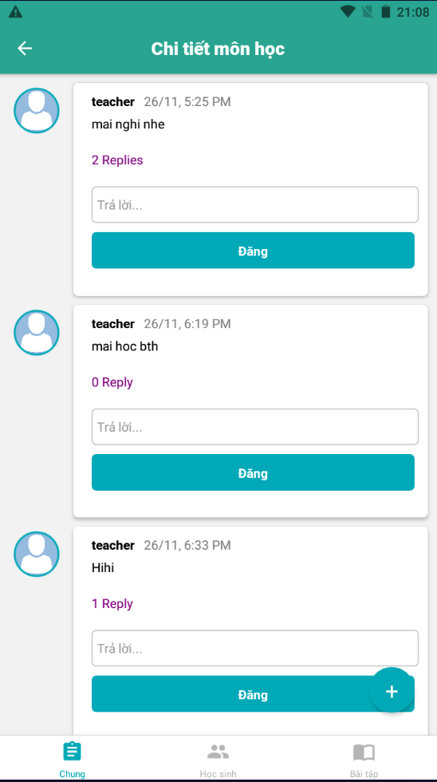

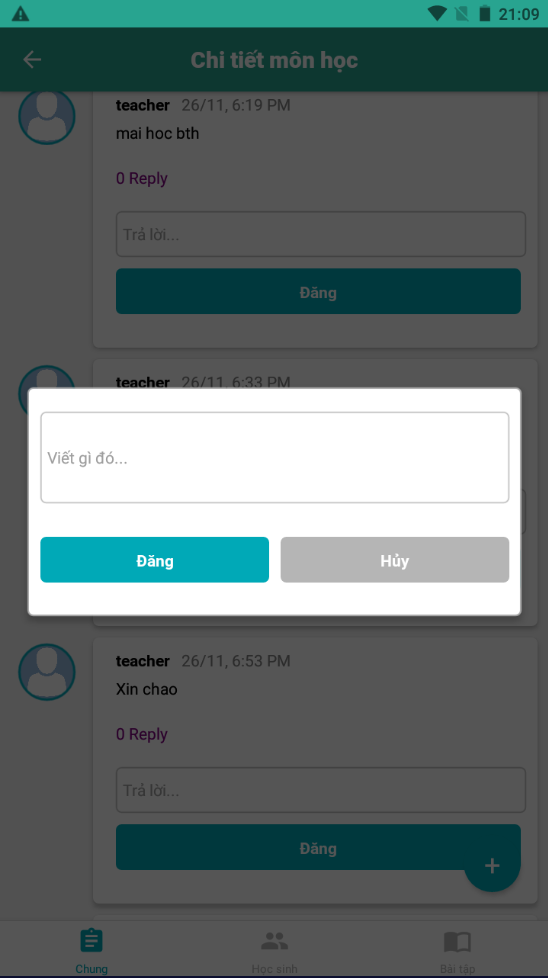

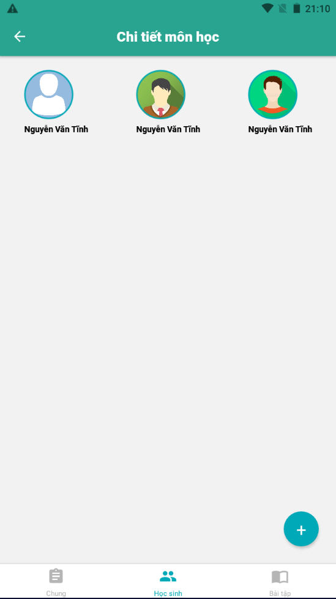

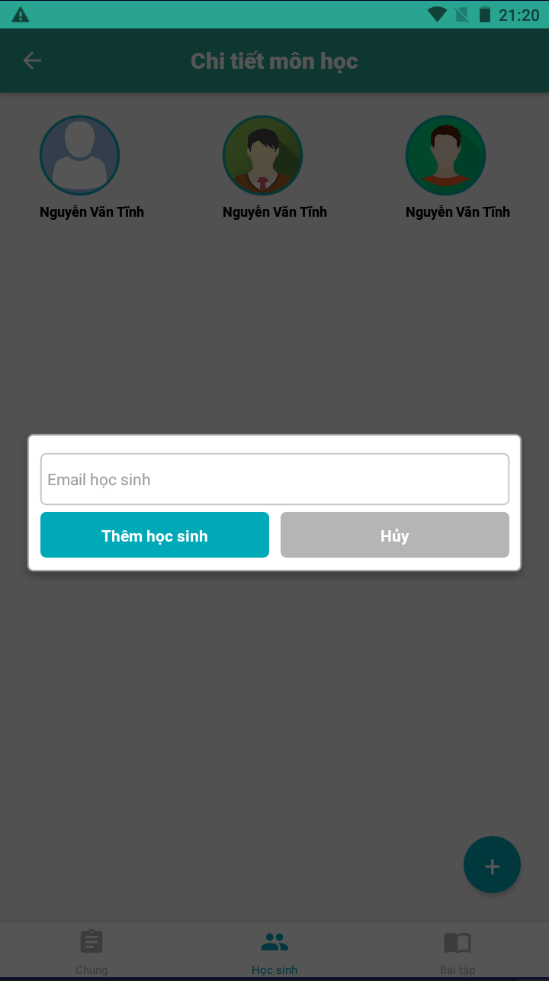

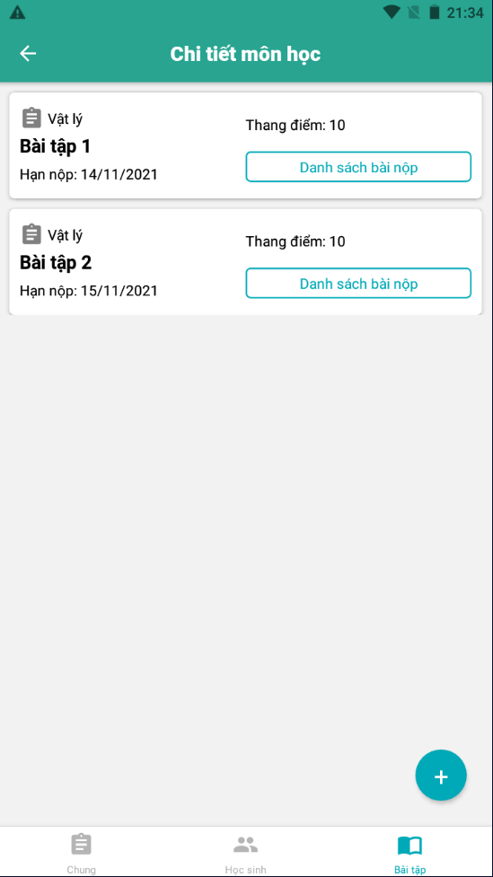

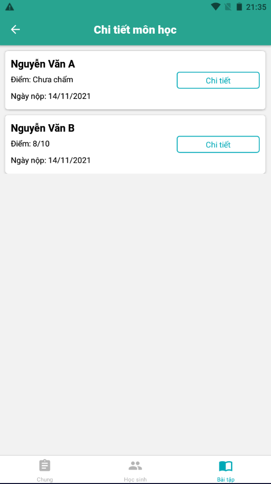

## Download and installing

Current version: 1.0.0

Download at folder: \Release

## Technology used
Language: Javascript
Frontend: React Native
Backend: NodeJs (ExpressJs)
Database: MongoDB (Mongo Atlas)
Server deploy: Heroku
Server stores files and images: Cloudinary

## Team member

[@nguyenvantinh06](https://github.com/nguyenvantinh06)

[@PeterNguyen-BK](https://github.com/PeterNguyen-BK)

[@li-truong](https://github.com/li-truong)

[@skylie628](https://github.com/skylie628)

## Disclamer

This is a team project, not a commercial product. The project is still in development and not fully functional yet.
